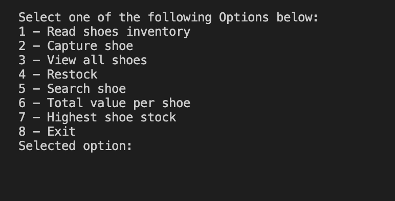
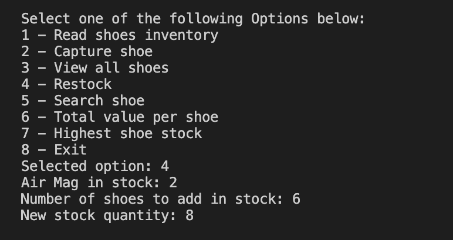
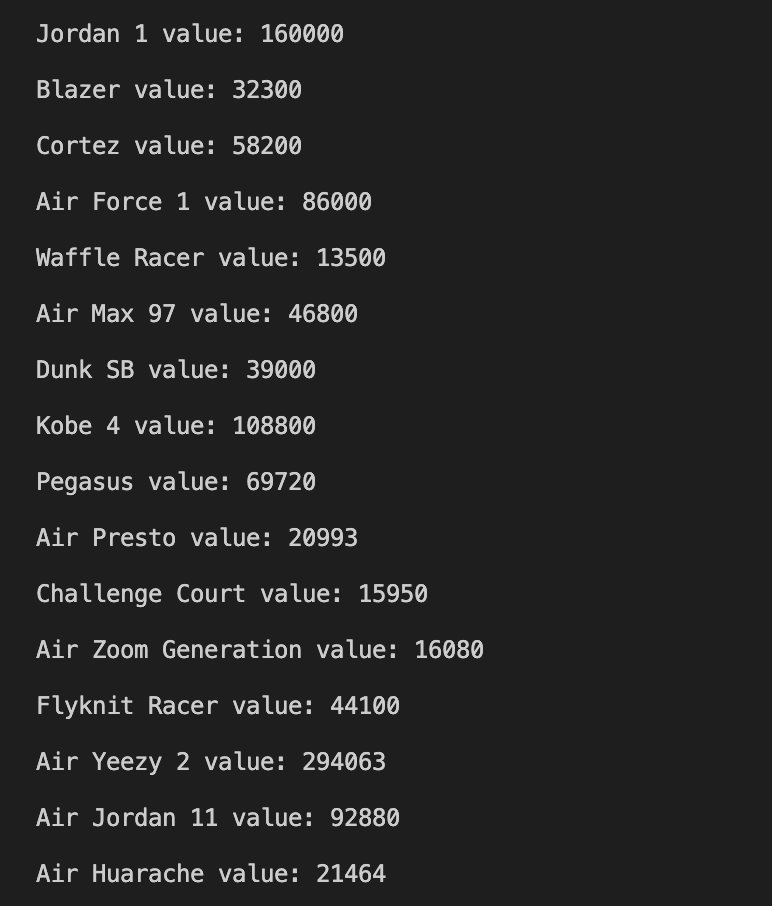
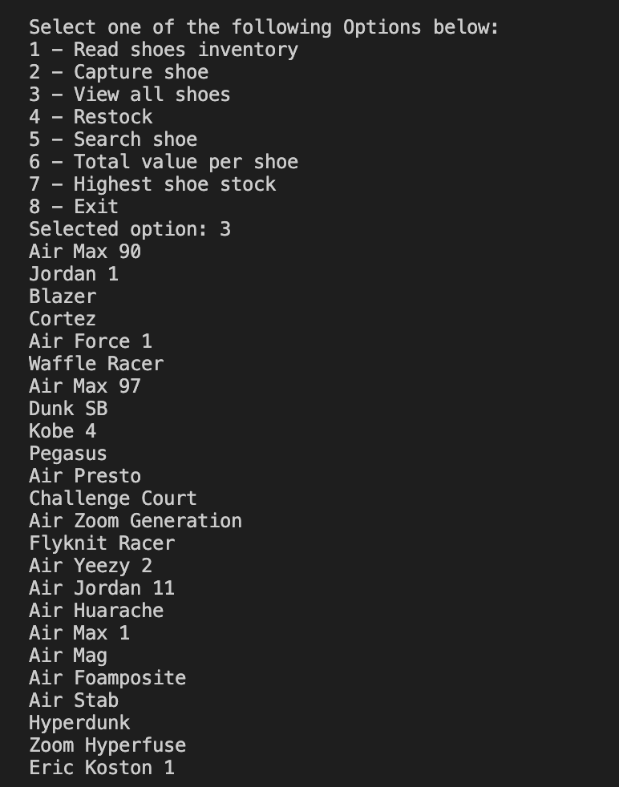

# Capstone Project

## The project name: Shoes inventory.
Programme which allowed the userto keep track of an inventory, in this casa for a shoes stop. Initial Menu to choose options. 

---

## Table of content.
Menu options.
1. **Read shoes inventory.** Open a txt file where all the object info are collected and stored.
2. **Capture shoe** Add a new shoes in your inventory with, Country details, product code, product name, price, quantity  in inventory.
3. **View all shoes** View all shoes in your invnetory
4. **Restock** The program will show shoe with the lowest quantity in stock, and ask you how many you want to add. The program shows the updated number and updates inventory txt file too.
5. **Search shoe** the user can search for a specific show/object in the inventory by typing its product code.
6. **Total value per shoe** as every shoe has a different price, the program will display the specific value for each product type, showing the value for each shoe moltiplied for its number in stock.
7. **Highest shoe stock**  the program display the shoe product with the higest  number in stock and display it as per on sale.
8. **Exit** exit the program
---
## Program description.
This program allows the user to track his inventory and update it by adding new items or modyfing the existing ones. Easy to use. Other store managers would like to be able to use your program to do the following:
1- Search products by code.
2- Determine the product with the lowest quantity and restock it.
3- Determine the product with the highest quantity.
4- Calculate the total value of each stock item. 

---

○ A table of contents to allow other people to quickly navigate
especially long or detailed READMEs.
○ An installation section that tells other users how to install your project
locally.

---
## Usage section and images
Easy to use by imputting in the progtam the specific section number in the displayed menu and following the istruction. The program can open and read txt files.

Menu

Menu option: restock

Menu option: Total value per shoe

Menu option: View all shoes

---

## Credits
Author: Elora Gnassi